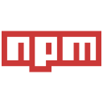

# Communicator

Communicator is a real-time one-to-one messaging application inspired by Messenger and built with the MERN stack. Authorized users can search for other users and send them a message, as a result new chat will be created and the person will be added to the user's connections list. It's possible to send messages to offline users too, messages are going to be saved in any case. Chats can be cleared or deleted (in this case, the person will be removed from the connections list). App UI is responsive and has both dark and light mode themes.

### Table of Contents

-  [Prerequisites](#prerequisites)
-  [Tech Stack](#tech-stack)
-  [Getting Started](#getting-started)
-  [Development](#development)
-  [Project Structure](#project-structure)

### Prerequisites

-   Node.js@18 and up
-   npm@9.5 and up

### Tech Stack

-   [Typescript](https://www.typescriptlang.org/) - strongly typed programming language
-   [Tailwind](https://tailwindcss.com/) - utility-first css framework
-   [React](https://react.dev/) - library for building reusable components
-   [React-router](https://reactrouter.com/en/main/start/overview) - enables "client side routing"
-   [React-hook-form](https://react-hook-form.com/) - validates react forms
-   [Zustand](https://docs.pmnd.rs/zustand/getting-started/introduction) - state-management solution
-   [Socket.io-client](https://socket.io/) - event-driven library for real-time web applications

### Getting Started

1\. First of all you need to clone the repository from github:

```sh
https://github.com/GeekoIsaGeek/communicator-front
```

2\. Next step requires you to run _npm install_ in order to install all dependencies.

```sh
npm install
```

3\. Now we need to set our env file. Go to the root of your project and execute this command.

```sh
cp .env.example .env
```

And now you should provide **.env** file all the necessary environment variables:

> VITE_API_URL=

> VITE_Socket_URL=

### Development

You can run development server by executing:

```sh
  npm run dev
```

### Project Structure

```bash
├─── public
├─── readme
├─── src
│   ├─── assets
│   ├─── components
│   ├─── config
│   ├─── hooks
│   ├─── layouts
│   ├─── pages
│   ├─── router
│   ├─── stores
│   ├─── types
│   ├───  utils
│   - App.vue
│   - index.css
│   - main.js
│   - socket.ts
- .env
- index.html
- package.json
- postcss.config.js
- README.md
- tailwind.config.js
- tsconfig.js
- tsconfig.node.js
- vite.config.js
```

Backend repo: https://github.com/GeekoIsaGeek/communicator-back
